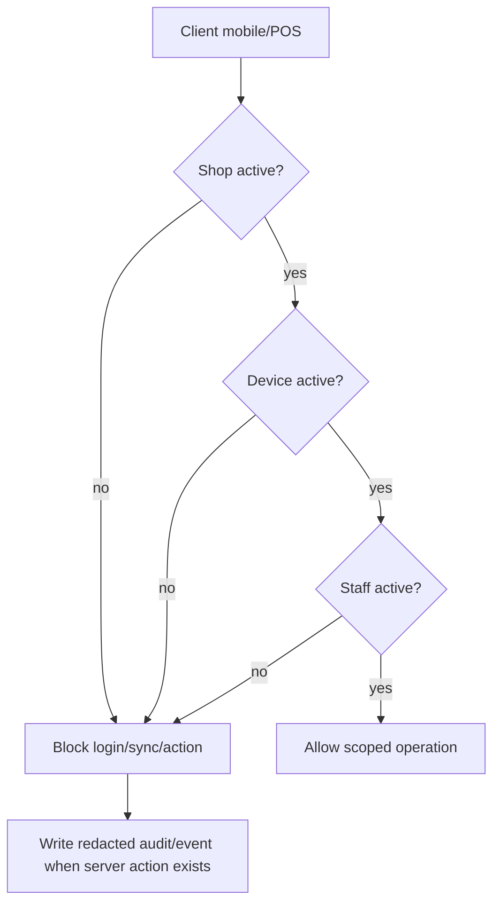

# Mobile/POS Enforcement Design

## Stato

- Task: `TASK-018`
- Stato: `DESIGNED_ONLY`
- Scope: fondazione tecnica per enforcement futuro Android, iOS e Win7 POS.
- Fuori scope: modifica dei client mobile/POS, sync reale, autenticazione POS completa, endpoint pubblici.

## Fonti attuali

- Admin Web: `shops`, `shop_members`, `staff_accounts`, `shop_devices`, `audit_logs`.
- RPC Admin Web: `shop_device_register`, `shop_device_revoke`, `shop_device_reactivate`, `shop_staff_suspend`, `shop_staff_reactivate`, `shop_staff_archive`, `platform_emergency_revoke_device`.
- Android/iOS attuali: sync owner-scoped via Supabase Auth, inventory, shared sessions e `sync_events`.
- Win7 POS attuale: utenti locali con PIN hash, `is_active`, failed attempts, lockout e security events.

## Principio

L'enforcement deve essere fail-closed lato server e confermato lato client. I client Android, iOS e POS possono mantenere UX offline, ma appena interrogano Admin Web/Supabase devono ricevere solo stati autorizzati e devono interrompere login, sync push e azioni operative quando shop, staff o device non sono piu attivi.

## Stati autoritativi

| Ambito | Sorgente | Stati bloccanti |
| --- | --- | --- |
| Shop | `shops.shop_status` | `suspended`, `archived` |
| Membership web | `shop_members.membership_status` | non `active` |
| Staff POS | `staff_accounts.status` | `pending_credential`, `suspended`, `archived` |
| Device | `shop_devices.status` | `pending`, `revoked`, `suspicious` |

## Regole di enforcement

## Online, offline e dati minimi

- Online: ogni login, sync push, azione sensibile, resume app e heartbeat futuro deve verificare shop, staff e device contro lo stato server.
- Offline: il client puo mantenere solo UX locale esplicitamente consentita; ogni vendita/offline write deve essere trattata come policy futura separata con grace period, massimali e audit locale.
- Dati minimi client: `shop_id`, `shop_code`, `staff_id`/`staff_code`, `shop_device_id`, `device_identifier`, stato locale cache e ultimo check server.
- Il client non deve conservare `credential_hash`, service-role key, token amministrativi o reason raw di audit.

1. Device authorization
   - Ogni device mobile/POS futuro deve risolversi in un record `shop_devices`.
   - Solo `status = 'active'` consente login operativo, sync push, download dati sensibili e nuove operazioni.
   - `pending`, `suspicious` e `revoked` bloccano le azioni sensibili.

2. Device revocation
   - `shop_device_revoke` e `platform_emergency_revoke_device` impostano `status = 'revoked'` e scrivono audit.
   - Un device revocato non puo essere riattivato dal proprio client.
   - Il client deve controllare lo stato a launch, resume, login, pre-sync, prima di operazioni sensibili e su heartbeat/realtime futuro.

3. Staff suspension
   - `staff_accounts.status != 'active'` blocca autenticazione POS e refresh di sessioni operative.
   - `pending_credential` consente solo setup/reset credenziale attraverso flusso amministrato futuro.
   - `archived` e terminale per il login operativo; eventuale ripristino deve essere task futuro esplicito.

4. Shop suspension
   - `shops.shop_status != 'active'` blocca nuovo login POS, autorizzazione device e sync push.
   - Diagnostica minima read-only puo restare disponibile solo se non espone dati sensibili.

5. Emergency revoke
   - Solo Platform Admin puo revocare globalmente un device via RPC auditabile.
   - La revoca e shop-scoped nel dato, ma non richiede che il Platform Admin sia membro dello shop.
   - Deve invalidare sessioni future e heartbeat; invalidazione sessioni gia emesse resta fuori scope TASK-018.

## Eventi richiesti

| Evento | Produttore | Consumatore futuro | Audit |
| --- | --- | --- | --- |
| `device.registered` | Shop Admin / client futuro | Admin Web, client owner | Si |
| `device.revoked` | Shop Admin | POS/mobile | Si |
| `device.emergency_revoked` | Platform Admin | POS/mobile | Si |
| `device.reactivated` | Shop Admin | POS/mobile | Si |
| `staff.suspended` | Shop Admin | POS | Si |
| `staff.reactivated` | Shop Admin | POS | Si |
| `shop.suspended` | Platform Admin | tutti i client | Si |
| `shop.reactivated` | Platform Admin | tutti i client | Si |
| `credential.reset_requested` | Shop Admin | POS auth futuro | Si, senza segreto |
| `auth.lockout` | POS auth futuro | Admin Web/POS | Si, senza PIN/password |

## Responsabilita

| Componente | Responsabilita |
| --- | --- |
| Admin Web | Scrive stati autoritativi tramite RPC, mostra audit redatto, non espone credential hash. |
| Supabase/RPC | Applica autorizzazione server-side, RLS, grants minimi e audit. |
| Android | In futuro controlla shop/device/staff prima di sync e azioni operative; nessuna modifica in TASK-018. |
| iOS | In futuro applica gli stessi gate di Android; nessuna modifica in TASK-018. |
| Win7 POS | In futuro migra/integra lockout e is_active con stati server; nessuna modifica in TASK-018. |

## Diagramma enforcement

## Punti di integrazione futuri

- Resolver device su `shop_code`, install fingerprint e server-issued device id.
- Resolver staff su `shop_code + staff_code`.
- Endpoint/RPC server-side per auth POS con hash credential server-only.
- Realtime o polling per revoche device/shop/staff.
- Session invalidation lato server per token/sessioni POS future.

## Edge case

- Device revocato mentre e offline: al primo check online deve bloccare sync push e nuove operazioni; eventuali eventi locali devono essere messi in quarantena fino a policy futura.
- Staff sospeso con sessione locale aperta: il refresh/heartbeat deve fallire chiuso e richiedere nuova autorizzazione.
- Shop sospeso durante sync: il server deve rifiutare push sensibili e il client deve fermare retry automatici non limitati.
- Device riattivato: il client deve richiedere un nuovo check server; non basta cambiare cache locale.
- Clock skew client: lockout, scadenze e session TTL devono usare tempo server.
- `source_device_id` nei sync event non deve mai sostituire `shop_devices.shop_device_id` come prova autorizzativa.

## Rischi residui

- I client mobile/POS esistenti non consumano ancora `shop_devices.status`.
- Non esiste ancora session model POS server-side.
- Offline grace policy per vendita POS non e definita.
- `sync_events.source_device_id` resta informativo e non e una prova di device authorization.
