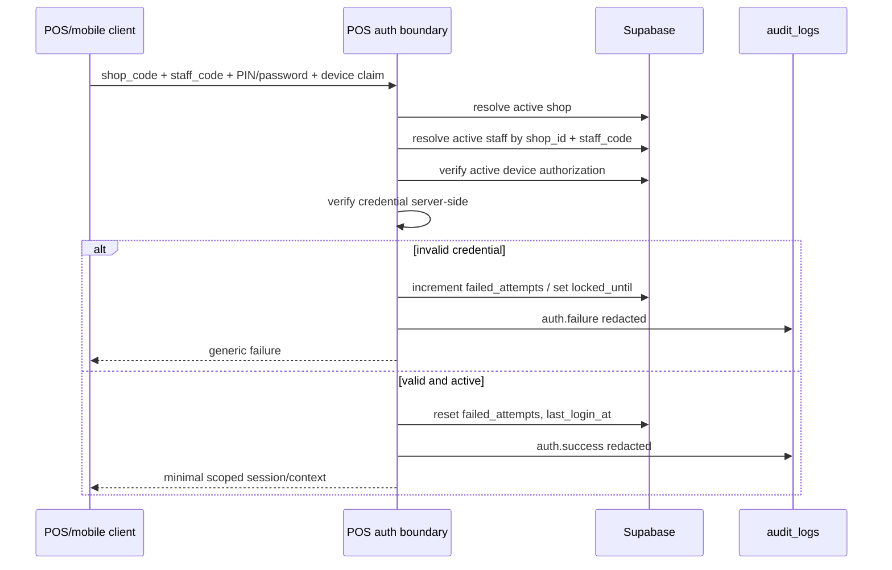

# POS Authentication Foundation

## Stato

- Task: `TASK-018`
- Stato: `DESIGNED_ONLY`
- Obiettivo: definire architettura futura per login POS con `shop_code`, `staff_code` e PIN/password.
- Fuori scope: login reale, endpoint pubblici, sessioni POS, provider social, email delivery e sync reale.

## Boundary sicurezza

- Il browser/client non deve ricevere `credential_hash`, secret, service-role key o token amministrativi.
- La verifica credenziale deve avvenire solo su server/RPC controllati.
- PIN/password sono accettati solo in request futura su TLS, non loggati, non salvati in chiaro e non restituiti.
- Gli audit devono registrare esito, shop, staff, device, motivo redatto e timestamp; mai PIN/password/hash.

## Modello dati previsto

| Concetto | Tabella corrente | Note |
| --- | --- | --- |
| Negozio | `shops` | `shop_code` identifica il tenant operativo. |
| Staff POS | `staff_accounts` | `staff_code`, ruolo operativo, status, credential metadata. |
| Device | `shop_devices` | autorizzazione/revoca per mobile/POS. |
| Audit | `audit_logs` | eventi redatti e shop-scoped. |
| Web user | `profiles`, `shop_members` | resta separato dagli staff POS. |

`staff_accounts` contiene gia colonne per `credential_hash`, `credential_kind`, `must_change_credential`, `failed_attempts`, `locked_until`, `last_login_at`, `suspended_at` e `archived_at`. La UI Admin Web deve continuare a usare read model safe che non selezionano o espongono `credential_hash`.

## Flusso login futuro

## Regole credenziali

- `shop_code` e `staff_code` devono essere normalizzati, confrontati in modo case policy esplicito e sempre risolti dentro lo stesso shop.
- `credential_hash` deve essere generato server-side con algoritmo moderno. L'implementazione Admin Web esistente usa `crypto.scrypt` in server code per la foundation staff; una scelta futura puo migrare ad Argon2id con migration dedicata.
- `must_change_credential = true` forza flusso di cambio credenziale prima delle operazioni POS.
- Reset credenziali: azione Shop Admin auditata che imposta nuovo hash temporaneo o flag di setup, senza inviare email in TASK-018.
- Lockout: incrementare `failed_attempts`, impostare `locked_until`, loggare evento redatto e restituire messaggio generico.
- Rate limit: applicare limiti per shop, staff, device e indirizzo sorgente; i messaggi di errore devono restare generici per evitare enumeration di `shop_code` o `staff_code`.
- Suspension: `status = 'suspended'` blocca login e refresh sessioni; `archived` blocca permanentemente l'account operativo.
- Device binding: una credenziale valida non basta; il login futuro deve richiedere `shop_devices.status = 'active'` e un device claim risolto server-side.
- Device revoke: `shop_devices.status = 'revoked'` blocca login anche con credenziale valida.
- Session invalidation: revoca device, sospensione staff o sospensione shop devono invalidare refresh/heartbeat futuri; invalidazione immediata di sessioni gia emesse richiede session store futuro.
- Offline grace: qualunque modalita offline deve avere durata, massimali, dati ammessi, replay policy e audit locale definiti in un task implementativo separato.

## Compatibilita client

| Client | Compatibilita prevista |
| --- | --- |
| Android 对货 | Oggi usa Supabase Auth owner-scoped e sync inventory; futuro adapter dovra aggiungere gate shop/device/staff senza rompere sync esistente. |
| iOS 对货 | Oggi segue account binding/sync owner-scoped; futuro adapter deve usare gli stessi stati server. |
| Win7 POS | Modello locale username/PIN/is_active/lockout e security events mappa bene su `staff_code`, `credential_hash`, `status`, `failed_attempts` e `locked_until`. |
| Admin Web | Resta superficie amministrativa per staff/device/reset/revoca; non diventa client POS. |

## Fuori scope esplicito

- Endpoint pubblico `/api/pos/login`.
- JWT/sessione POS.
- Realtime revocation.
- Email, magic link o reset via provider esterno.
- Google, Apple, WeChat login.
- Modifiche Android, iOS o Win7 POS.
- Deploy production.

## Rischi residui

- Va definita una politica ufficiale di offline grace per POS.
- Va definita la durata sessione POS e invalidazione immediata alla revoca.
- Va scelto se mantenere `scrypt` o introdurre Argon2id con parametri versionati.
- Va progettato il bootstrap sicuro del primo staff credential per nuovo shop.
