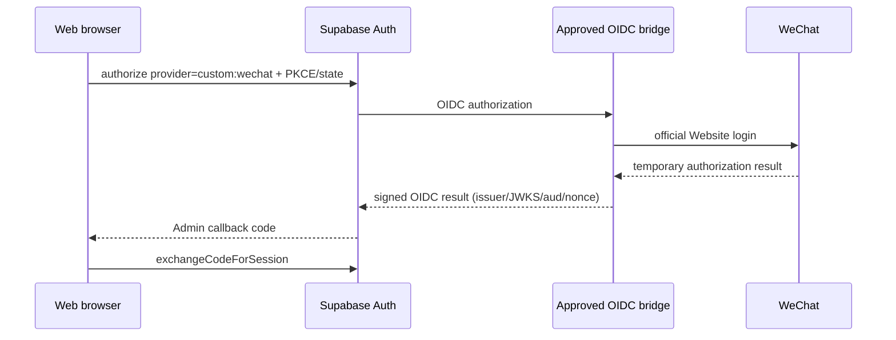
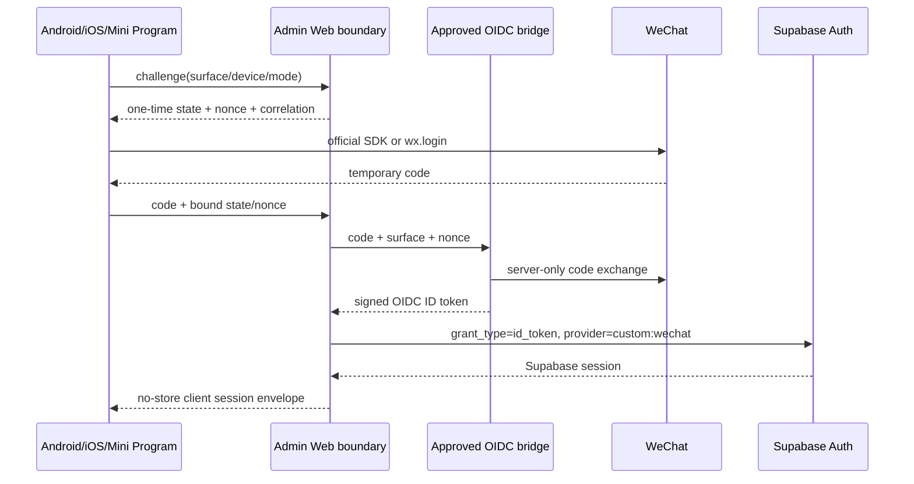

# ADR-002 — WeChat identity through an approved custom OIDC bridge

- Status: `CHANGES_REQUIRED`; architecture target retained but bridge is not implemented
- Date: 2026-08-12
- Owners: Admin Web server boundary and canonical Supabase project
- Runtime classification: `FOUNDATION_IMPLEMENTED, LIVE AUTH AND MINI PROGRAM PARITY INCOMPLETE`

## Decision

Retain path **C** as the target architecture: an independently operated, approved, standards-compliant OIDC identity bridge is the only component allowed to exchange WeChat codes. This is a security decision, not a completion claim. The bridge, issuer, discovery document, JWKS and rotation service do not exist in these repositories or in a verified environment, so all flags remain OFF and the flow remains `CHANGES_REQUIRED`.

The bridge must use asymmetric signing, published HTTPS discovery/JWKS, rotation, fixed issuer, explicit acceptable audiences, nonce, short token lifetime, and a stable opaque `sub`. A bridge consisting only of the current exchange interface is not operational and must not be activated. The Admin Web owns the server boundary and native/Mini Program exchange endpoints; no client holds AppSecret or bridge secret.

Website login uses Supabase `signInWithOAuth({ provider: "custom:wechat" })`, preserving Supabase PKCE/state/callback/session cookies. Android, iOS, and Mini Program adapters may obtain a temporary WeChat code only through a verified official platform integration; they use the same Admin endpoint and import the returned supported Supabase session into the existing single session owner. Fixtures exercise only the application contract while the feature is OFF; they are not live-provider evidence.

## Direct OAuth2 compatibility matrix

The Supabase side was verified against current official documentation and the current Auth implementation. The WeChat side could not be revalidated because the official documentation origin was blocked by the execution environment’s site-safety policy. Historical endpoint names are therefore included only as activation questions, never as trusted configuration.

| Property | Supabase custom OAuth2 expectation | WeChat candidate requiring official revalidation | Decision evidence |
|---|---|---|---|
| Authorization endpoint | HTTPS OAuth authorization endpoint; Supabase owns callback/state | Historically `open.weixin.qq.com/connect/qrconnect` for Website Application QR login | `UNVERIFIED_WECHAT`; do not configure |
| Token endpoint | Standards-compatible server token exchange | Historically an API endpoint requiring AppID, AppSecret and code in query parameters | Method/client-auth compatibility not proved |
| Token method/content type | Provider adapter must accept the provider response through the documented OAuth contract | Historically GET/query and JSON rather than a conventional form POST | Potential incompatibility; official proof absent |
| Token response | Access token and stable subject data consumable by the provider adapter | Historically includes access token plus OpenID | Additional OpenID mapping may be required |
| Userinfo | Standards-compatible configured userinfo mapping | Historically requires both access token and OpenID | Bearer-only compatibility not proved |
| PKCE | Supabase browser flow uses PKCE/state around its callback | No current official WeChat PKCE evidence available | Cannot claim end-to-end PKCE support |
| State | Required and validated | Historically supported on Website login | Must be revalidated; server challenge remains mandatory for native/Mini |
| Scope | Configured provider scopes | Historically `snsapi_login` for Website login and a different native scope | Surface-specific scope cannot be assumed interchangeable |
| Stable identifier | Provider subject must remain stable and opaque | OpenID is AppID-scoped; UnionID may exist only under documented association conditions | Never merge by profile attributes; explicit link when UnionID absent |
| Email | May be optional for custom providers | No reliable email claim expected | `email_optional`; no synthetic email |
| Multiple client IDs | OIDC may allow acceptable audiences; OAuth registration remains provider-specific | Website/Android/iOS/Mini Program use separate AppIDs | One direct OAuth registration cannot be assumed to cover all surfaces |
| Callback | Supabase Auth callback plus application allowlist | Website callback/domain registration is external | Public HTTPS staging callback required; no localhost |
| Identity linking | Supabase supports authenticated linking with its documented safeguards | Stable provider identity must be proved first | Linking stays separately flagged OFF |

Conclusion: direct OAuth2 is **not approved** because the token method/response, OpenID-dependent userinfo, PKCE and multi-AppID semantics are not proven compatible. Direct OIDC is also not approved because no WeChat issuer/discovery/JWKS/ID-token contract was verified. Path C remains the intended design, but the missing real bridge is a code/runtime blocker rather than a mere credential toggle.

## Evidence and feasibility gate

- Supabase documents custom OAuth2/OIDC providers as generally available, names them `custom:<identifier>`, supports OIDC issuer/discovery/JWKS, acceptable client IDs, and `email_optional`: [Custom OAuth 2.0/OIDC providers](https://supabase.com/docs/guides/auth/custom-oauth-providers).
- Supabase documents OAuth redirect/deep-link flows and PKCE for native clients: [Native mobile deep linking](https://supabase.com/docs/guides/auth/native-mobile-deep-linking?platform=swift).
- Supabase documents manual identity linking as beta and automatic verified-email linking behavior: [Identity linking](https://supabase.com/docs/guides/auth/auth-identity-linking).
- The official Supabase Auth implementation in `internal/api/token_oidc.go` accepts `grant_type=id_token` for a configured `custom:` OIDC provider and verifies enabled provider, issuer discovery/JWKS, audience, nonce, and token subject before issuing/linking a session. Application code relies on that implementation contract; it does not verify or mint JWT itself.
- Apple App Review Guideline 4.8 explicitly covers third-party/social login and requires an equivalent privacy-preserving login unless an exception is proven: [App Review Guidelines](https://developer.apple.com/app-store/review/guidelines/).
- Maven Central exposes Tencent’s Android artifact `com.tencent.mm.opensdk:wechat-sdk-android:6.8.34`, with Tencent WeChat Inc. metadata and Apache-2.0 license: [Maven Central artifact](https://central.sonatype.com/artifact/com.tencent.mm.opensdk/wechat-sdk-android/6.8.34). This proves an Android dependency source/version only; it does not prove console registration, signatures, callback behavior or a live login.
- The official `wechat-miniprogram/api-typings` repository states that Mini Program API declarations are generated from official documentation. The client pins `miniprogram-api-typings@5.2.3`: [official WeChat Mini Program typings](https://github.com/wechat-miniprogram/api-typings).

The available in-app browser blocked the official WeChat Open Platform documentation origin during this execution, and official-domain search returned no accessible result. Site-safety policy prohibited a workaround. Therefore token/userinfo details, iOS distribution, `code2Session`, UnionID eligibility, Universal Link requirements and cross-application association are **not claimed as live-verified**. Activation requires an authorized human to verify them in the official WeChat console/docs without exposing secrets.

## Alternatives

### A — Direct Supabase custom OAuth2 to WeChat: not approved

Supabase's generic custom OAuth implementation uses the standards-based OAuth2 token exchange and bearer userinfo model, with server-controlled PKCE behavior. Direct WeChat compatibility could not be proved against accessible official WeChat documentation in this execution, including token method/format, query OpenID, userinfo authentication, PKCE, and multi-AppID identity behavior. It must not be forced.

### B — Direct WeChat OIDC: not approved

No accessible official evidence proved that WeChat itself exposes the required OIDC discovery, issuer, JWKS, audience, nonce, and ID-token contract. A provider without those properties cannot be configured as trusted OIDC.

### D — Synthetic or client-trusted handoff: prohibited

Fake email, deterministic password, automatic magic link, handcrafted/unverified JWT, service role in a client, WeChat token as Supabase token, nickname/avatar/phone similarity, and permanently separate un-linkable accounts all violate the security/product invariants.

## Canonical identity and linking

Supabase `auth.users` plus the personal profile remains canonical. `auth.identities` is sufficient when `custom:wechat` produces a stable provider identity, so no duplicate identity mapping table is introduced.

The bridge `sub` is an opaque stable subject derived from a verified cross-application WeChat identifier only when the official Open Platform association guarantees it. UnionID is optional until official evidence proves its availability. When UnionID is absent, a new AppID/OpenID must not auto-merge; the user signs into the existing canonical account and explicitly links the new identity. Nickname, avatar, phone, or email similarity never links accounts.

Native link uses the same one-time code/state/nonce exchange with `link_identity: true` and the current verified Supabase access token. Admin Web exposes the official Supabase `linkIdentity` redirect only to an authenticated personal account and only when the separate `WECHAT_AUTH_LINKING_ENABLED` flag is enabled. An identity already owned by another user fails closed without revealing that user. Unlink is not exposed by the new gateway until a separate recent-session check and “at least one other login method” review is approved; the linking flag must remain OFF until this threat model and external provider are accepted. Link/unlink events use redacted audit identifiers.

WeChat never grants `platform_admin`, membership, or shop role. Profile status, shop status, and active membership are checked on every read; removing membership revokes data access without waiting for a new login.

## Implemented and external components

| Component | Owner | State |
|---|---|---|
| Default-OFF status, web redirect/callback, state/nonce challenge ledger, exchange boundary | Admin Web | Implemented with fixtures; not live |
| Supabase `custom:wechat` provider | Supabase project operator | Not configured/verified |
| OIDC issuer, discovery, JWKS, rotation, audience and WeChat server exchange | Approved bridge operator | Missing |
| Website Application registration/domain | WeChat Open Platform owner | Missing/unverified |
| Android package/signature/AppID/device | Android + WeChat owner | External verification required |
| iOS binary/package, bundle/Universal Link/AppID/device | iOS + WeChat owner | Missing/unverified |
| Mini Program AppID, request domains, privacy/review | Mini Program + WeChat owner | Missing/unverified |

## Four-surface flows

## Operational consequences

- Server challenge state is random, hashed at rest, surface/device/IP/mode/correlation-bound, five-minute TTL, one-time consumed, and database rate-limited.
- Outbound bridge URL is HTTPS and host-allowlisted, redirects are rejected, body size is bounded, timeout is eight seconds, and no automatic code retry occurs.
- The gateway returns sanitized codes and never logs codes/tokens. Audit logs contain only hashes, surface, mode, reason, and correlation ID.
- Shop sales stay behind SECURITY DEFINER RPCs with `search_path = ''`, schema qualification, `auth.uid()`, active profile/shop/membership, bounded keyset pagination, and no direct table/view grants.
- Mini Program updates use bounded adaptive three-to-thirty-second polling, stop in background and refresh on foreground/pull. It is labelled automatic polling and explicitly **not realtime**. WMP-012 remains incomplete until a verified private shop-scoped invalidation path replaces it.
- No production config or migration is changed by this execution.

## Rollback

Keep every surface and linking flag OFF. If any controlled environment is later enabled, disable the affected flag first, revoke bridge/provider credentials and sessions, preserve redacted audit evidence, then revoke new RPC execution only if data isolation is in doubt. Do not drop source POS/catalog/image data. The new read functions can be removed in a reviewed forward migration after clients stop using them.

## App Store 4.8

Decision: **APP_REVIEW_DECISION_REQUIRED**. The app may qualify for the business/enterprise exception only if Apple review can verify that the app requires an existing enterprise account. That evidence is not available here. Do not automatically add Sign in with Apple, and do not claim compliance until the product owner/app-review specialist records the applicable path.

## WECHAT-004 identity-link closeout

The application/database transition is a recoverable saga because the external
provider and Supabase identity commit cannot share one physical transaction.
`wechat_identity_link_attempts` stores only hashed/bounded protocol state,
actor, provider, surface, expiry, status and correlation metadata. It never
stores provider codes or tokens. The allowed lifecycle is `pending` ->
`provider_completed` -> `audit_finalized`, with terminal `failed`, `conflict`
and `expired` states. Starting a later attempt supersedes another live attempt
for the same actor/provider.

Both native challenge and exchange boundaries enforce the independent
`WECHAT_AUTH_LINKING_ENABLED` switch before provider work. Web callback marker
parity is checked before PKCE exchange. A marker-loss or post-provider crash is
recovered only for the currently authenticated canonical actor by reconciling
`auth.identities`; provider completion is checked before expiring the attempt,
and audit finalization is idempotent. Invalid/unissued exchange state is not
persisted as an unauthenticated audit row; outcomes after a valid challenge has
been consumed remain audited. No profile similarity merge or automatic unlink is
introduced.

This closes the code-side recovery invariant only. The approved bridge,
official AppIDs, provider configuration, callback domains and live same-profile
evidence remain `EXTERNAL_ACTIVATION_REQUIRED`; all surface and linking flags
remain OFF.
