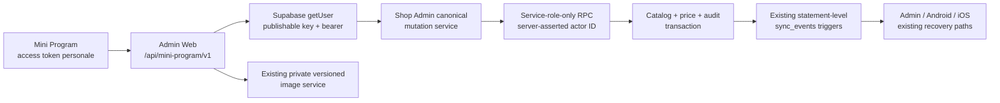

# ADR-003 — WeChat Mini Program controlled catalog mutations

- Stato: `ACCEPTED_ARCHITECTURE — IMPLEMENTATION_PENDING`
- Ambito: WECHAT-003 / WMP-017–WMP-022
- Data: 2026-08-12
- Owner: MerchandiseControl Admin Web e progetto Supabase canonico
- Classificazione corrente: `CHANGES_REQUIRED`

## Decisione

Il WeChat Mini Program puo amministrare il catalogo soltanto attraverso un
adapter bearer sottile posseduto dall'Admin Web. L'Admin Web resta l'unico
owner di API server-side, autorizzazione, servizi di dominio, migration
Supabase, audit, proiezione History, storage immagini e pubblicazione degli
eventi sync.

L'adapter Mini non introduce una seconda implementazione CRUD. Risolve un
account personale dal bearer Supabase, costruisce un contesto personale
shop-scoped e richiama lo stesso service layer canonico Shop Admin. Le
operazioni che richiedono atomicita, idempotenza o semantiche non ancora
presenti vengono aggiunte sotto quel service layer come un solo orchestration
contract autenticato, non come logica nelle route e non come RPC separata per
ogni pulsante.

Le decisioni vincolanti sono:

1. nessuna scrittura diretta del Mini sulle tabelle Supabase;
2. nessuna service role, AppSecret o `session_key` nel Mini;
3. nessun diritto shop implicito per un platform admin;
4. capability personali derivate server-side da profilo, shop e membership
   attivi;
5. `updated_at` esatto come revisione ottimistica per prodotti, categorie e
   fornitori; version ID esatto per immagini;
6. idempotenza durevole legata a actor, shop, operation e payload canonico;
7. replacement categoria/fornitore e archiviazione nella stessa transazione;
8. prezzi correnti e storico prezzi aggiornati atomicamente, con history
   append-only;
9. riuso dei trigger `sync_events` esistenti, senza corsia WeChat separata;
10. immagini private e versionate attraverso la pipeline esistente, ma con un
    boundary Mini che ammette soltanto actor personali con membership;
11. archiviazione tramite tombstone e ripristino controllato, mai hard delete;
12. risposte, audit e History sanitizzati e fail-closed su ogni mismatch di
    shop o identita.

Questa ADR decide il target architetturale. Non attesta che route, migration,
UI Mini, test live o attivazione esterna siano gia completi e non porta alcun
task a `DONE`.

## Contesto verificato e componenti canonici

| Capacita | Implementazione da riusare | Decisione |
| --- | --- | --- |
| Mutazioni catalogo Shop Admin | `src/server/shop-admin/catalog-mutations.ts`: `createProduct`, `updateProduct`, `archiveProduct`, `restoreProduct`, `createCategory`, `updateCategory`, `archiveCategory`, `createSupplier`, `updateSupplier`, `archiveSupplier`, `validateCatalogProductInput` | Estrarre/iniettare un contesto personale bearer senza duplicare validazione o mapping risultato |
| UI Admin | `src/app/shop/actions.ts` | Non chiamare dal Mini: sono wrapper `FormData`, cookie, redirect e revalidation |
| Contesto e errori sicuri | `src/server/shop-admin/action-context.ts`: `resolveShopActionContext`, `mapShopAdminRpcResult`, `shopAdminActionResult` | Estendere con un modo `personal_only` e client bearer iniettato; default Admin/staff invariato |
| Accesso shop | `src/server/shop-admin/data-access.ts`: `resolveShopAdminDataAccess`, `revalidateShopAdminDataAccessForPublish` | Riusare `client`, `strictRequestedShop` e revalidation; non risolvere cookie staff nel percorso Mini |
| Capability | `src/server/shop-admin/permissions.ts`: `canShopAdmin` e matrice owner/manager/viewer | Fonte applicativa canonica; il database resta il controllo autorevole finale |
| Scope writer DB | `app_private.is_active_shop_catalog_writer` e `app_private.resolve_shop_catalog_scope` | Richiedere caller `service_role`, actor personale asserito dal server, profilo/shop/membership attivi e ruolo owner/manager |
| CAS prodotto | `shop_catalog_update_product_if_revision_with_sync` e `shop_catalog_set_product_archived_if_revision_with_sync` | Riusare senza indebolire il confronto `updated_at` |
| Audit catalogo | `app_private.write_shop_admin_audit` e `audit_logs` | Riusare con source/correlation server-bounded e proiezione client separata |
| Eventi sync | trigger statement-level `app_private.emit_atomic_sync_events_statement_v1` | Sono la pubblicazione canonica; nessun emit post-write dal Mini |
| Facade sync TypeScript | `src/server/shop-admin/sync-event-writer.ts` | Resta intenzionalmente no-op per evitare duplicati |
| Immagini | `src/server/shop-admin/product-images/{contract,auth,service}.ts` e `src/app/api/shop/product-images/*` | Riusare contract e service; aggiungere solo un resolver/adapter Mini `personal_only` |
| Prezzo canonico | `inventory_product_prices` e la semantica atomica verificata da `pos_article_mutate_v1` | Estrarre una mutazione personale equivalente; non chiamare l'endpoint POS staff |
| Idempotenza di riferimento | receipt e locking di `admin_customer_order_transition_v1` | Adattare il pattern actor+shop al catalogo, senza copiare auth staff; il caller service role e l'actor personale restano controlli distinti |
| Read Mini correnti | `src/server/wechat/user-rpc.ts` e `src/app/api/mini-program/v1/*` | Conservare per le letture; introdurre un mapper mutativo tipizzato anziche appiattire gli errori |
| Import Excel | `docs/DECISIONS/DEC-002-mini-program-excel-import-gate.md` | `EXCEL_IMPORT_DEFERRED_BY_DECISION_GATE`; nessuna API o UI Excel Mini |

Il flusso `archiveCategoryWithStrategy` / `archiveSupplierWithStrategy` corrente
non e una primitive atomica riutilizzabile per il Mini: legge pagine, aggiorna
assegnazioni e archivia in chiamate distinte. Resta valido come comportamento
Admin esistente, ma il percorso WECHAT-003 deve spostare replacement e
tombstone in una singola transazione database.

## Boundary e flusso delle richieste



### Adapter bearer

La route catalogo mutativa e una sola route `POST`, coerente con il namespace
esistente:

`/api/mini-program/v1/catalog/mutations`

La route:

- accetta soltanto `application/json` e una singola operazione logica;
- legge lo stream con limite reale, anche senza `Content-Length`;
- valida schema, UUID, timestamp e campi esatti, rifiutando chiavi ignote;
- valida il bearer con un client Supabase isolato, publishable key, header
  `Authorization` e `auth.getUser()`, senza mai esporre la service role;
- deriva `actor_profile_id` soltanto dall'ID utente verificato, mai dal body o
  dai metadata;
- dopo la verifica personale usa una seconda chiamata trusted, server-only, al
  service canonico e non inoltra il bearer personale all'RPC mutativo;
- applica timeout e mapping HTTP, aggiunge header `no-store`, `nosniff` e un
  request ID server-side non sensibile;
- non contiene query catalogo, calcolo permessi, diff, audit o payload sync.

Il resolver bearer e esclusivamente personale, salta deliberatamente la
sessione cookie staff e fallisce se `getUser()` non verifica un account
personale. Il percorso Admin e il login staff/shop-code non cambiano. La
credenziale trusted resta confinata al modulo `server-only` e non viene mai
serializzata, loggata o restituita.

Il client non puo fornire `actor_profile_id`, `actor_kind`, ruolo, permesso,
owner, source sync o audit result. `shopId` seleziona soltanto lo scope
richiesto: server e database devono dimostrare che appartiene al principal.

### Envelope mutativo

Il contratto v1 usa un'unione discriminata chiusa:

```text
schemaVersion: 1
shopId: UUID
operation: operazione supportata
targetId: UUID | assente per create
expectedUpdatedAt: timestamp UTC esatto | assente soltanto quando non applicabile
payload: oggetto tipizzato e bounded per operation
```

`Idempotency-Key` e `X-Correlation-ID` sono header UUID obbligatori, non campi
del body.

Operazioni supportate:

- `product_create`;
- `product_update`;
- `product_archive`;
- `product_restore`;
- `product_price_update`;
- `category_create`, `category_update`, `category_archive`,
  `category_restore`;
- `supplier_create`, `supplier_update`, `supplier_archive`,
  `supplier_restore`.

Il prezzo non e modificabile incidentalmente con `product_update`: usa
`product_price_update`, cosi storico, concorrenza e audit non possono essere
aggirati. `product_update` puo sostituire atomicamente `categoryId` e
`supplierId` insieme agli altri dati prodotto; il database emette fatti audit
semantici separati per ciascuna relazione cambiata. `product_create` puo
includere relazioni e prezzi iniziali solo se l'orchestratore valida le
relazioni e inserisce le righe iniziali di price history nella stessa
transazione.

## Autorizzazione e capability

Il bearer identifica sempre un account personale canonico Supabase. WeChat
OpenID, nickname, avatar, codice `wx.login` o metadata del client non sono
identita applicativa e non conferiscono accesso.

| Principal effettivo nello shop | Read catalogo/History/immagini | Prodotti e prezzi | Categorie e fornitori | Immagini mutative |
| --- | --- | --- | --- | --- |
| `viewer` con membership attiva | si | no | no | no |
| `shop_owner` con membership attiva | si | si | si | si |
| `shop_manager` con membership attiva | si | si, secondo la matrice canonica | si, secondo la matrice canonica | si |
| platform admin senza membership | no | no | no | no |
| platform admin anche owner/manager attivo | si, come account personale membro | si, soltanto per la membership | si, soltanto per la membership | si, soltanto per la membership |
| profilo, shop o membership sospesi/revocati | no | no | no | no |

Ogni mutation verifica due volte, all'ingresso e immediatamente prima della
pubblicazione/commit:

- sessione personale verificata con `auth.getUser()` e actor UUID derivato dal
  server;
- profilo attivo;
- shop attivo;
- membership attiva sullo shop richiesto;
- ruolo e capability specifica;
- target appartenente allo stesso scope catalogo autorizzato;
- stato target e relazioni;
- revisione corrente quando applicabile.

Il controllo database autorevole accetta l'actor asserito soltanto dall'RPC
concesso alla `service_role`, richiede che il caller database sia davvero
`service_role` e rivalida profilo, shop e membership personali. Non usa il ruolo
dichiarato dal client e non considera l'esistenza in `platform_admins` una
capability shop. Per un target UUID di un altro shop la risposta e
indistinguibile da `entity_not_found`; nessuna proprieta del target esterno
viene restituita.

## Service layer e orchestrazione database

Il service canonico resta sotto `src/server/shop-admin`. Le funzioni esistenti
e le policy testo vengono riusate o estratte in helper puri condivisi. Un
adapter sotto `src/server/wechat` puo tradurre l'envelope e il risultato, ma
non puo implementare CRUD.

Un solo RPC versionato, server-only e dispatchato per `operation` fornisce
l'envelope transazionale e idempotente. E collocato nello schema `public` per
PostgREST, ma non e direttamente eseguibile da `PUBLIC`, `anon` o
`authenticated`: soltanto il gateway Admin con `service_role` puo invocarlo. Il
nome concreto deve seguire il naming catalogo corrente; la decisione semantica
e un contratto equivalente a `shop_catalog_mutate_idempotent_v1`, non una
famiglia di RPC WeChat per ogni azione.

L'RPC:

- e `SECURITY DEFINER` con `search_path = ''`, nomi schema-qualified e
  `statement_timeout = '5s'`;
- e revocato a `PUBLIC`, `anon` e `authenticated` e concesso esplicitamente
  soltanto a `service_role`;
- riceve `actor_profile_id` soltanto dal gateway dopo `auth.getUser()` e
  rivalida nel database caller, profilo, shop, membership e capability;
- non concede accesso diretto alle tabelle receipt/audit/sync;
- normalizza nuovamente input e barcode nel database;
- usa le primitive catalogo esistenti dove la semantica coincide;
- aggiunge primitive private guarded per price, restore relazione e
  replacement atomico;
- esegue mutazione, audit, receipt e modifiche che attivano i trigger sync
  nella stessa transazione;
- restituisce solo l'envelope sicuro previsto.

La publishable key e il bearer personale sono usati soltanto per
`auth.getUser()`. Il gateway non inoltra quel bearer all'RPC: usa una credenziale
`service_role` server-only e aggiunge l'actor UUID verificato. Le nuove tabelle
interne sono private/force-RLS e senza grant al Data API; l'execute grant
dell'RPC versionato e disponibile soltanto alla `service_role`.

## Idempotenza, retry e replay

Ogni mutation richiede una chiave UUID generata una volta per l'azione logica.
Una tabella receipt privata, immutabile e bounded conserva almeno:

- `actor_profile_id` risolto dal gateway con `auth.getUser()` e asserito dal
  server;
- `shop_id` verificato;
- `idempotency_key`;
- operation, target e revisione attesa;
- digest SHA-256 del request canonico, inclusi correlation ID e payload;
- risposta sanitizzata bounded;
- audit ID, timestamp e retention.

La chiave unica e `(actor_profile_id, shop_id, idempotency_key)`. Prima della
lettura o creazione receipt l'RPC acquisisce un advisory transaction lock sullo
stesso tuple scope.

- primo uso: esegue la mutation e registra receipt nello stesso commit;
- replay con stesso actor, shop, key e digest: restituisce la stessa risposta
  con `idempotent: true`, senza nuovo update, price row, audit o sync event;
- stessa key con payload, operation, target, revisione o correlation diversi:
  `idempotency_conflict`;
- stessa key di un altro actor o shop: non e leggibile ne riusabile nello scope
  originale;
- timeout del gateway: il retry usa la stessa key e risolve in replay se la
  transazione aveva committato, oppure tenta di nuovo se era stata rollbackata;
- receipt scadute sono eliminate solo da cleanup server-side; retention
  iniziale minima 30 giorni.

Una rejection deterministica successiva ad autenticazione e scope check puo
essere registrata nel receipt per rendere stabile il retry. Sessione assente,
membership mancante, rate limit e failure transitorie non devono creare un
risultato success fittizio. Nessun receipt contiene token, URL firmati o
payload audit completi.

## Concorrenza

### Prodotti, categorie e fornitori

`updated_at` e la revisione reale. Il client invia il timestamp esatto ricevuto
dal read model; il database blocca la riga `FOR UPDATE` e confronta il valore
esatto. Nessun arrotondamento, clock client o confronto "piu recente di" e
ammesso.

- mismatch: `stale_version`, nessuna scrittura;
- target assente nello shop: `entity_not_found`;
- barcode concorrente: vincolo database e `duplicate_barcode`;
- no-op semantico: risposta esplicita, nessun evento sync spurio;
- assegnazione categoria/fornitore: CAS sul prodotto e verifica/lock della
  relazione attiva nello stesso shop.

Le guardie prodotto esistenti per update/archive/restore restano canoniche.
Categorie e fornitori devono ricevere guardie equivalenti prima di essere
esposti dal Mini.

### Archiviazione con replacement

Se una categoria o un fornitore e referenziato da prodotti attivi, il payload
deve indicare una relazione sostitutiva attiva dello stesso shop oppure la
creazione tipizzata di una sostituzione. Non e consentito lasciare uno stato
intermedio o svuotare implicitamente le assegnazioni.

Un'unica transazione:

1. valida scope, capability, idempotenza e revisione originale;
2. blocca original e replacement/create;
3. ricalcola il conteggio dei prodotti attivi, ignorando il conteggio mostrato
   dal client;
4. riassegna tutti i prodotti coinvolti con una sola operazione set-based;
5. archivia l'originale con `deleted_at` e nuovo `updated_at`;
6. scrive audit e receipt;
7. lascia ai trigger statement-level gli eventi completi.

Il guard `guard_catalog_parent_tombstone_v1` resta una difesa finale. Una nuova
referenza concorrente, una relazione sostitutiva archiviata o un timeout causa
conflict/rollback dell'intera transazione, mai un apply parziale. Una relazione
non referenziata puo essere archiviata senza replacement.

### Prezzi

`product_price_update` richiede product ID, `expectedUpdatedAt`, tipo prezzo
reale e numero JSON non formattato. Il server:

- accetta soltanto un valore finito tra `0` e `999999999999.999` inclusi;
- canonizza alla precisione reale massima di tre decimali;
- blocca e verifica il prodotto attivo nello shop;
- aggiorna il prezzo corrente sul prodotto;
- inserisce una nuova riga append-only in `inventory_product_prices` con
  `effective_at` canonico e univoco;
- aggiorna `updated_at`, audit e receipt nello stesso commit.

Un retry idempotente non aggiunge una seconda price row. Il client formatta la
valuta dello shop soltanto per la presentazione. `product_update` non puo
aggirare questo percorso.

### Immagini

La concorrenza immagini usa il vero `inventory_product_image_versions.id`, non
`updated_at` o un path client:

- intent crea una versione pending con path canonici server-side;
- finalize e idempotente per lo stesso version ID;
- remove richiede `expectedVersionId` e fallisce stale se la versione attiva e
  cambiata;
- replace e intent + upload + finalize; non sovrascrive la versione attiva;
- URL upload/read sono firmati, brevi e non vengono salvati nei receipt.

## Pipeline immagini e boundary personale

Il Mini usa route sottili nel namespace `/api/mini-program/v1`, ma i parser e
service sono quelli esistenti:

- bucket privato `product-images`;
- body JSON massimo 16 KiB;
- main JPEG massimo 1 MiB e 1600 px per lato;
- thumbnail JPEG massimo 90 KiB e 384 px per lato;
- batch read massimo 16;
- signed read URL con TTL 5 minuti;
- hash SHA-256, byte count, MIME, dimensioni e aspect ratio verificati dal
  server al finalize;
- object path scelto esclusivamente dal server e legato a shop/product/version;
- cleanup pending per upload incompleti e delete storage falliti.

`resolveProductImageRequestActor` attualmente supporta anche
`platform_admin`. Il Mini non puo invocare quel ramo. Un resolver Mini separato
o un parametro non ambiguo `personal_only` deve:

1. verificare il bearer;
2. richiedere profilo e shop attivi;
3. richiedere membership attiva;
4. usare `products.read` per read URL e `products.write` per intent/finalize/
   remove;
5. passare sempre `actorKind = personal_account` alle funzioni database.

Le funzioni database immagini rieseguono la membership check. Un platform admin
senza membership e quindi negato sia prima sia dentro il service. La service
role eventualmente usata dal service Admin per firmare o ispezionare oggetti
storage resta esclusivamente server-side e non sostituisce la verifica actor,
shop e prodotto.

Intent, finalize e remove ricevono correlation/idempotency metadata bounded.
Il receipt dell'intent conserva version ID e stato, mai signed URL/token. Un
replay autorizzato di un intent ancora valido puo rifirmare lo stesso path dopo
revalidation; un intent scaduto richiede una nuova azione logica e una nuova
key. Finalize e remove combinano receipt e semantica idempotente nativa del
version ID.

## Soft delete e restore

Prodotti, categorie e fornitori usano `deleted_at` e `updated_at`. Nessuna API
Mini espone `DELETE` fisico. I grant `DELETE` catalogo restano revocati agli
utenti autenticati.

- archive imposta tombstone e produce il normale evento catalog tombstone;
- restore azzera tombstone soltanto con capability, CAS e vincoli unici ancora
  validi;
- restore barcode/nome in conflitto restituisce `conflict`, non rinomina;
- restore categoria/fornitore e consentito solo dopo l'introduzione delle
  primitive guarded e della lettura autorizzata degli archiviati;
- il read model Mini deve esporre `state=active|archived`, mai un catalog
  indiscriminato, e includere `updated_at` per il CAS.

## Audit e History sicura

Audit tecnico e History client sono due boundary distinti. Il Mini non scrive
audit e non legge direttamente `audit_logs` o `sync_events`.

La prima esecuzione di ogni mutation autorizzata registra:

- actor personale risolto;
- shop verificato;
- surface bounded `mini_program` come metadata osservazionale, mai come prova
  di autorizzazione;
- entity type e target shop-bound;
- operation e result;
- correlation/idempotency ID bounded o digest quando opportuno;
- riepilogo campi cambiati allowlisted, senza payload completo;
- revisione attesa/committata dove utile.

Un replay non duplica l'audit di business. Tentativi viewer e denial successivi
a una membership shop verificata producono un audit blocked nello stesso shop.
Una richiesta per shop senza membership non puo iniettare audit in quello shop:
viene registrata, se necessario, soltanto come evento boundary account-scoped
con shop/correlation hash e senza dati del target.

Una RPC read separata espone una proiezione catalog History shop-scoped con
keyset pagination e limite massimo 100. Supporta filtri bounded per data,
entity, operation e target. La proiezione include soltanto:

- timestamp;
- actor personale con label business-safe, senza email o identificatori
  WeChat;
- shop gia autorizzato;
- entity type e ID gia dimostrato nello shop;
- operation normalizzata;
- summary allowlisted;
- result;
- correlation redatta quando utile.

Deve normalizzare almeno:

- product create/update/archive/restore/price/category/supplier/image;
- category create/update/archive/restore;
- supplier create/update/archive/restore.

Non espone token, code OAuth, AppSecret, `session_key`, PIN, password, service
role, signed URL, object path, payload JSON completi, PII non necessaria o entry
di un altro shop. La `wechat_sync_history_page_v1` corrente resta una vista
operativa degli eventi sync e non sostituisce questa proiezione audit/catalogo.

## Convergenza cross-platform

Le modifiche business toccano le tabelle catalogo/prezzi canoniche. I trigger
statement-level gia installati su suppliers, categories, products e prices
scrivono `sync_events` nella stessa transazione e includono gli entity ID
completi. Android, iOS e Admin continuano a usare pull/recovery/reconcile
esistenti.

Non viene creato:

- un outbox WeChat;
- un topic WeChat;
- un client event costruito dal Mini;
- un secondo emit RPC dopo il commit;
- un payload catalogo completo su WebSocket.

Una price mutation genera il normale cambiamento prodotto e la normale entry
prices. Un replacement set-based genera gli eventi catalogo bounded dai trigger.
Receipt e transazione impediscono duplicati su replay. `sync-event-writer.ts`
resta no-op perche un emit TypeScript aggiuntivo duplicherebbe gli eventi.

## Limiti, rate limit e timeout

Il contratto iniziale e deliberatamente non-bulk:

- massimo 16 KiB per body catalogo JSON;
- una operation per richiesta;
- risposta JSON bounded a 64 KiB;
- massimo 5 secondi per l'RPC database;
- timeout Auth `getUser()` massimo 2 secondi, timeout RPC massimo 6 secondi e
  budget gateway complessivo massimo 8 secondi, senza retry automatico della
  route;
- retry client soltanto con la stessa idempotency key;
- rate limit database iniziale: 60 mutation per actor+shop in 5 minuti e 600
  per shop in un'ora;
- le mutation relation set-based contano come una richiesta ma restano soggette
  a timeout e rollback totale;
- intent immagine conserva i limiti esistenti: 20 per actor in 15 minuti e 100
  per shop in un'ora.

Il rate limit autorevole viene applicato dopo avere verificato l'actor e lo
shop, e prima della mutation. Un eventuale WAF e difesa addizionale, non il
controllo unico. Timeout, `Content-Length`, stream body e response bound devono
avere test espliciti.

## Tassonomia errori

Il client riceve soltanto codici allowlisted, messaggi localizzabili e request
ID non sensibili:

| HTTP | Codici |
| --- | --- |
| 400 | `validation_failed`, `invalid_category`, `invalid_supplier`, `invalid_price` |
| 401 | `unauthenticated`, `session_expired` |
| 403 | `membership_missing`, `permission_denied`, `profile_suspended`, `shop_suspended` |
| 404 | `entity_not_found` |
| 409 | `conflict`, `duplicate_barcode`, `stale_version`, `idempotency_conflict`, `invalid_state` |
| 413 | `payload_too_large`, `image_too_large` |
| 415 | `unsupported_media_type` |
| 422 | `image_invalid` |
| 429 | `rate_limited` |
| 503 | `retryable_error` |

Errori SQL, constraint name, stack, policy, existence di target cross-shop,
token e dettagli storage non entrano nella risposta. Eccezioni non allowlisted
diventano `retryable_error` o un errore interno generico senza dettagli.

## Read model, cache e aggiornamento automatico

Dopo una mutation riuscita il Mini:

1. invalida soltanto cache shop/entity interessate;
2. ricarica dettaglio e liste da endpoint autorizzati;
3. usa la revisione restituita dal server;
4. deduplica eventi/richieste tramite mutation result e sequence esistenti;
5. conserva il form su errori offline, stale o retryable.

Le letture devono restare keyset-paginated e bounded. Archived products,
categories e suppliers sono leggibili soltanto nello shop autorizzato e solo
quando richiesti esplicitamente per restore/history.

Finche non esiste un invalidation channel privato e verificato, il Mini conserva
il polling adattivo documentato, refresh immediato dopo mutation, sospensione in
background e refresh al foreground. La UI dice "Aggiornamento automatico", non
"Tempo reale". WMP-024 resta `REVIEW_WITH_LIMITATION`; questa ADR non autorizza
un nuovo WebSocket o canale sync.

## Excel

La decisione `docs/DECISIONS/DEC-002-mini-program-excel-import-gate.md` resta
vincolante: `EXCEL_IMPORT_DEFERRED_BY_DECISION_GATE`.

L'envelope catalogo non contiene operation import, la UI Mini non mostra un
pulsante placeholder e nessun parser workbook viene portato nel client. Il CRUD
catalogo puo essere implementato e revisionato indipendentemente.

## Test di accettazione architetturale

L'implementazione non e review-ready senza test mirati almeno per:

- owner e manager autorizzati secondo matrice;
- viewer negato per ogni mutation;
- platform admin senza membership negato, incluse immagini;
- profilo/shop/membership sospesi e revoca tra preflight e commit;
- target e relation cross-shop indistinguibili da not-found;
- barcode duplicato e race concorrente;
- stale `updated_at` per product/category/supplier e sostituzione relazioni;
- replay identico, key con payload diverso e replay dopo timeout;
- receipt isolato per actor e shop;
- replacement concorrente, conteggio ricalcolato e rollback atomico;
- price bounds/precision, una sola price-history row e sync coerente;
- image intent/finalize/remove replay, stale version, path manipulation,
  oversized/malformed JPEG e cleanup;
- audit success/blocked senza PII e History filtrata/paginata;
- un solo insieme di eventi trigger per mutation e nessuna corsia WeChat;
- body/response bounds, timeout, rate limit e metodo non consentito;
- read archived autorizzato, cache invalidation e fallback polling.

I test devono estendere i contratti esistenti, in particolare
`supabase/tests/cross_platform_product_revision_guard.sql`,
`supabase/tests/task_137_release_catalog_security.sql`,
`supabase/tests/task_137_product_catalog_images.sql`,
`supabase/tests/task_137_product_image_denied_audit_regression.sql`,
`supabase/tests/task_145_pos_article_mutation_v1.sql` e i foundation test
catalogo/sync/immagini corrispondenti. Nessun test fixture puo essere presentato
come convergenza live.

## Alternative respinte

- **Direct table CRUD dal Mini:** respinto per authorization, audit, CAS e sync
  facilmente aggirabili.
- **Chiamare le Server Actions Admin:** respinto perche dipendono da cookie,
  `FormData`, redirect e UI state.
- **Copiare il CRUD sotto `src/server/wechat`:** respinto per divergenza di
  normalizzazione, prezzi, replacement e permessi.
- **Usare l'endpoint POS price/article:** respinto perche appartiene a staff,
  device e lease POS, non agli account personali.
- **Usare direttamente il ramo platform-admin immagini:** respinto perche
  WECHAT-003 non concede diritti shop impliciti.
- **Replacement in batch multipli:** respinto perche produce stati intermedi e
  recovery indeterminato.
- **Hard delete:** respinto perche rompe tombstone, recovery e audit.
- **Sync/outbox WeChat dedicato:** respinto perche duplica il canale canonico.
- **Audit o permission client-side:** respinto perche non affidabile.

## Rollout e rollback

Il percorso resta OFF per default dietro la feature flag server-side separata
`WECHAT_MINI_PROGRAM_CATALOG_MUTATIONS_ENABLED`, attiva soltanto con il valore
esatto `true`, finche migration locali, pgTAP, test route/service, build Admin e
test Mini non passano. Le
funzioni nuove vengono prima validate su Supabase locale e poi, solo con
allowlist e runbook, in un ambiente non-production verificato. Nessuna migration
viene applicata a produzione per provare il flusso.

Rollback operativo:

1. disabilitare la flag mutation Mini;
2. lasciare attive le letture autorizzate e il fallback polling;
3. preservare catalogo, tombstone, price history, receipt e audit;
4. revocare in una migration forward l'execute grant del nuovo RPC se
   l'isolamento e in dubbio;
5. non cancellare dati business, receipt o evidenza per mascherare un errore.

WECHAT-003 resta `CHANGES_REQUIRED` fino a implementazione, test e review
esplicita. Questa ADR non abilita il provider WeChat, non pubblica il Mini
Program e non modifica produzione.

## WECHAT-004 decision: opaque BFF session and sync-policy parity

The final Mini trust boundary is option A, a short opaque BFF session. The
client receives a random opaque token, while the server stores only its hash
and binds it to canonical actor, `mini_program` surface, installation/device,
expiry and auth generation. Logout/revocation closes it. The Mini never receives
a general-purpose Supabase access or refresh token, so it cannot authenticate
to legacy tables or catalog RPCs. Every read or mutation is dispatched through
an allowlisted Admin route and a service-role-only wrapper with server-derived
actor plus current profile/shop/membership/permission checks. Android, iOS and
Admin Web retain their existing personal-account lanes.

The mutation boundary preserves exact shop scoping, operation-specific CAS,
durable idempotency, rate admission, audit and the canonical statement-trigger
`sync_events` lane. Catalog and image receipt rows remain immutable during the
30-day replay horizon. Private, advisory-lock-serialized opportunistic cleanup
removes only older rows in bounded batches; public/authenticated/service callers
cannot invoke cleanup directly.

Inbound Mini convergence uses the existing `sync_events` watermark and epoch,
not a fourth engine. The BFF returns bounded minimal deltas, entity identifiers
and tombstones; a gap, retention loss or epoch change triggers bounded reconcile
and controlled bootstrap. A durable per-user/per-shop Mini outbox preserves the
same idempotency key across ambiguous retries, ordered entity dependencies and
explicit conflicts. Polling is adaptive (about 3 seconds active, up to 30
seconds idle) and is labelled automatic update, not realtime. A private push
transport remains optional external hardening.

Exact replay of an image upload intent is accepted only while its exact version
is still pending and unexpired; the service independently checks expiry before
minting Storage upload capabilities. Image remove binds shop authorization in
the locking target predicate. All WeChat feature flags remain OFF, and no
production or staging migration is authorized by this ADR.
